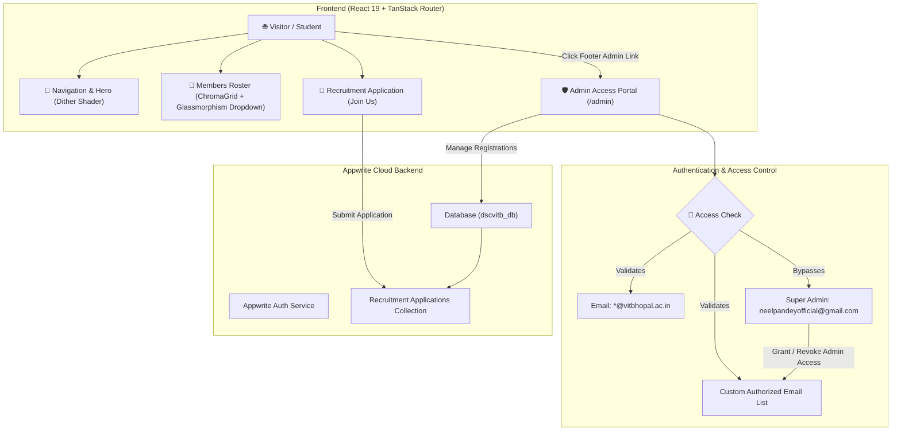

# ⚡ Data Science Club — VIT Bhopal (DSC VITB)

[](https://react.dev/)
[](https://www.typescriptlang.org/)
[](https://tanstack.com/router)
[](https://appwrite.io/)
[](https://vitejs.dev/)
[](https://tailwindcss.com/)
[](https://threejs.org/)

The official, high-performance web platform for the **Data Science Club at VIT Bhopal University**. Built to showcase club projects, host event registrations, highlight member dossiers, and streamline core team recruitment via **Appwrite Cloud**.

---

## 🌟 Key Features

* **🎨 Cyberpunk & Glassmorphism Aesthetic**: Rich dark mode visuals, HSL glow effects, backdrop blur shaders, custom cursors, and responsive layouts.
* **🌀 Shader-Powered Hero Section**: Live dynamic GLSL Dither shader background visualising data science concepts (graphs, noise, neural node scatter plots).
* **👥 Member Roster & ChromaGrid**: Interactive grid featuring team cards with spotlight animations, domain color badges (Platinum, Gold, Silver, Neon Blue, Emerald), and strict core team filtering.
* **📱 Custom Mobile Glassmorphism Dropdown**:
  * Animated glass dropdown menu replacing native selects on mobile.
  * Live **Member Count Pills** per team.
  * **Auto-Slideshow Mode**: Automatically cycles through departmental teams every 3.5 seconds until manually interacted with.
* **📝 Online Core Team Recruitment**: Seamless application form submitting candidate profiles directly to Appwrite Cloud.
* **🛡️ Admin Access Portal (`/admin`)**:
  * **Strict Campus Domain Filter**: Restricts standard admin logins to `@vitbhopal.ac.in` student email addresses.
  * **Super Admin Override**: `neelpandeyofficial@gmail.com` enjoys direct super administrative privileges.
  * **Email Access Manager 👑**: Super Admins can dynamically grant or revoke admin access for specific team lead email addresses.
  * **Real-time Applicant Dashboard**: View, filter (by domain/team/status), search, and update candidate statuses (*Pending*, *Shortlisted*, *Accepted*, *Rejected*).
* **⚙️ Automated Database Provisioning**: Automated CLI & script setup (`npm run setup:db`) to provision Appwrite database schemas and attributes in seconds.

---

## 🛠️ Tech Stack & Badges

| Layer | Technology | Description |
| :--- | :--- | :--- |
| **Frontend Framework** |  | Next-gen UI rendering |
| **Language** |  | Strict end-to-end type safety |
| **Routing** |  | Fully type-safe file-based client & SSR routing |
| **Backend & Auth** |  | Authentication, Database, and Member Recruitment Storage |
| **3D & Shaders** |  | Dither WebGL fragment shaders & 3D Interactive Globe |
| **Animations** |  | Smooth timeline animations and reactive UI motion |
| **Styling** |  | Utility-first CSS & Vanilla glassmorphism styling |
| **Build Tool** |  | Instant HMR dev server & optimized bundler |

---

## 🔄 System Architecture & Workflow



---

## 📁 Project Structure

```text
dsc-club-website/
├── public/                     # Static public assets, branding logos, icons
├── scripts/
│   └── init-appwrite-db.js     # Automated Appwrite Database & Attribute setup script
├── src/
│   ├── assets/                 # SVGs and static media files
│   ├── components/
│   │   ├── pages/
│   │   │   ├── AdminPanel.tsx  # Recruitment Admin Dashboard component
│   │   │   └── AdminPanel.css  # Glassmorphism styling for Admin Dashboard
│   │   ├── sections/
│   │   │   ├── TeamSection.tsx # ChromaGrid Member Roster & Mobile Dropdown
│   │   │   ├── TeamSection.css # Roster glassmorphism & dropdown keyframes
│   │   │   ├── JoinSection.tsx # Core Team recruitment application form
│   │   │   └── FooterSection.tsx # Site footer with Admin Access link
│   │   ├── site/               # Shared site components (Navbar, Globe, TextLoop)
│   │   └── ui/                 # React Bits UI components (ChromaGrid, Dither)
│   ├── lib/
│   │   ├── appwrite.ts         # Appwrite Client, Account, & Database utilities
│   │   └── utils.ts            # Helper utilities
│   ├── routes/                 # TanStack file-based routes
│   │   ├── __root.tsx          # Root layout shell
│   │   ├── index.tsx           # Homepage
│   │   ├── about.tsx           # About section route
│   │   ├── members.tsx         # Members & Leads dossier route
│   │   ├── join.tsx            # Recruitment route
│   │   └── admin.tsx           # Protected Admin Access route
│   ├── routeTree.gen.ts        # Auto-generated TanStack router tree
│   ├── main.tsx                # Client app entrypoint
│   └── styles.css              # Global CSS & color tokens
├── .env.example                # Appwrite environment variable template
├── package.json                # Project scripts and dependencies
├── vite.config.ts              # Vite & TanStack plugin configuration
└── README.md                   # Project documentation
```

---

## 🚀 Quick Start Guide

### Prerequisites
* **Node.js**: `v22.12.0` or higher
* **npm**: `v10.0.0` or higher

### 1. Clone & Install Dependencies
```bash
git clone https://github.com/dscvitb/dsc-club-website.git
cd dsc-club-website
npm install
```

### 2. Configure Environment Variables
Copy `.env.example` to create your local `.env` file:
```bash
cp .env.example .env
```

Add your Appwrite credentials to `.env`:
```dotenv
VITE_APPWRITE_PROJECT_ID="6a931d3300098a4116bf"
VITE_APPWRITE_PROJECT_NAME="dscvitb"
VITE_APPWRITE_ENDPOINT="https://sgp.cloud.appwrite.io/v1"
APPWRITE_API_KEY="your_secret_appwrite_api_key_here"
```

### 3. Provision Appwrite Database Automatically
Run the setup script to automatically build the database, collection, and required schema attributes on Appwrite Cloud:
```bash
npm run setup:db
```

### 4. Run Development Server
```bash
npm run dev
```
Open [http://localhost:5173](http://localhost:5173) in your browser.

---

## 📦 Scripts Overview

| Command | Description |
| :--- | :--- |
| `npm run dev` | Starts Vite development server with HMR |
| `npm run build` | Builds optimized production bundle |
| `npm run preview` | Previews production build locally |
| `npm run setup:db` | Provisions Appwrite database, recruitment collections, and attributes |
| `npm run lint` | Runs ESLint type checks and code quality rules |
| `npm run format` | Formats codebase using Prettier |

---

## 🌐 Deployment (Vercel)

This project is configured for seamless deployment on **Vercel**:

1. Push your repository to GitHub.
2. Import the project in [Vercel](https://vercel.com).
3. Set **Framework Preset** to **Vite** (or TanStack Start).
4. Under **Environment Variables**, add:
   * `VITE_APPWRITE_PROJECT_ID`
   * `VITE_APPWRITE_PROJECT_NAME`
   * `VITE_APPWRITE_ENDPOINT`
5. Click **Deploy**.

---

## 📄 License

This project is licensed under the MIT License — see the [LICENSE](LICENSE) file for details.

---

<p align="center">
  Crafted with ❤️ by the <strong>Data Science Club Web Team</strong> at VIT Bhopal University.
</p>
