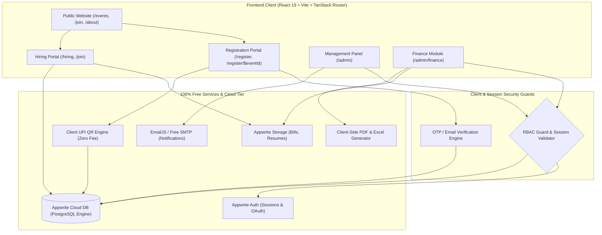
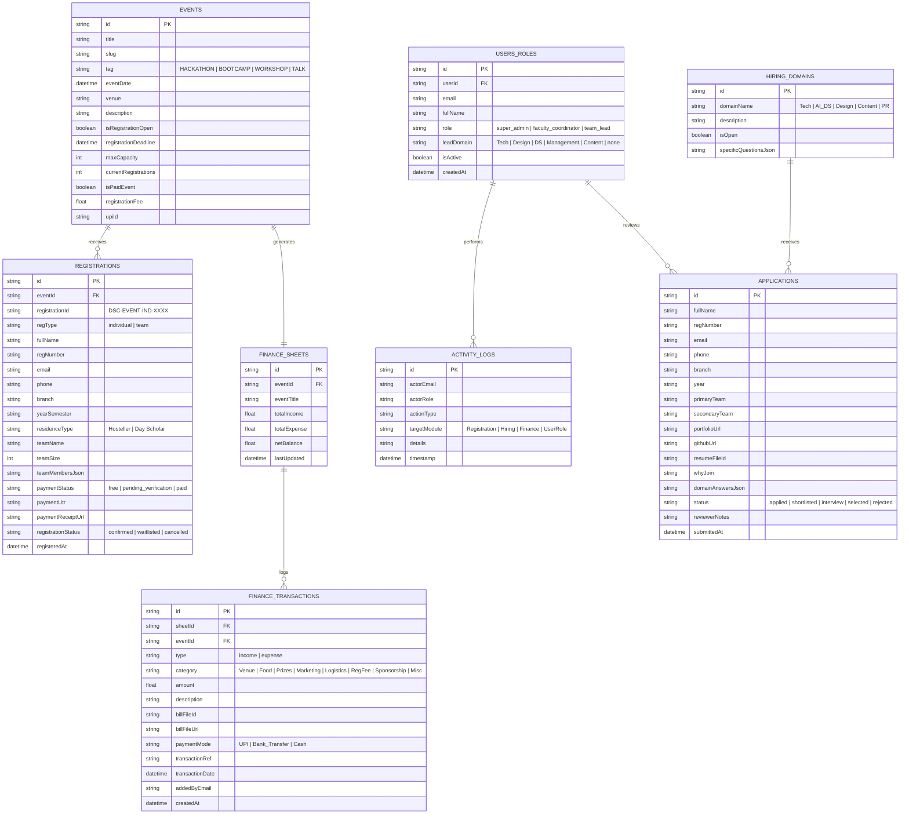
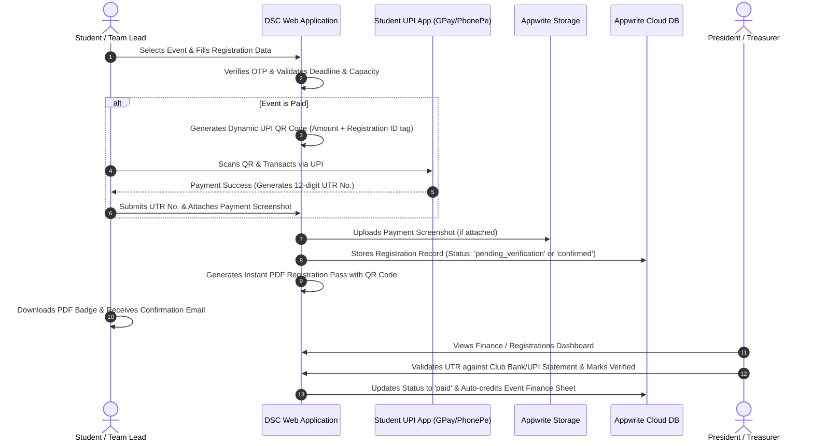
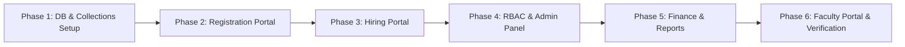

# System Design Document: Data Science Club (DSC) Web Platform
**Document Version:** 1.0.0  
**Target Platform:** DSC Club Website (VIT Bhopal)  
**Target Deployment:** 100% Free-Tier / Zero-Cost Architecture  
**Author:** Software / Dev Team  
**Status:** Architectural Blueprint (Pending Implementation Approval)

---

## 1. Executive Summary & Core Objectives

The Data Science Club (DSC) web platform is a unified, high-performance web system designed to streamline all club operations at zero recurring operational cost. The platform consolidates public-facing engagements and internal administrative workflows into three core pillars:

1. **Public Event & Membership Registration Portal:** Automated intake for individual and team registrations, OTP/email verification, waitlist capacity management, deadline enforcement, and zero-fee UPI/fee receipt generation.
2. **Hiring & Recruitment Portal:** Multi-domain candidate screening with dynamic team-specific questionnaires, resume uploads, application status tracking (Applied $\to$ Shortlisted $\to$ Interview $\to$ Selected $\to$ Rejected), and bulk notification triggers.
3. **Club Management Panel & RBAC:** Multi-tiered role-based access control separating Super Admins (President, VP, GS, JS), Faculty Oversight (Faculty Coordinator), Team Leads (scoped strictly to their respective team domain), and general visitors.
4. **Dedicated Finance Section:** Isolated, audit-ready financial bookkeeping per event and across overall club reserves, with itemized income/expense entries, bill uploads, auto-computed profit/loss metrics, and exportable reports for department approvals.

### Core Architecture Principle: 100% Zero-Cost Guarantee
Every technology, API, database layer, storage bucket, email service, and deployment service in this design is selected to operate strictly within lifetime free tiers:
- **Zero software licensing or SaaS subscription costs.**
- **Zero payment gateway transaction/onboarding fees** (leveraging native UPI intent + direct reference verification).
- **Client-side computational offloading** (PDF/Excel generation, OTP generation, CSV ingestion performed in the browser runtime).

---

## 2. 100% Free-Tier Tech Stack Matrix

| Architectural Layer | Selected Technology / Service | Free-Tier Quota & Limits | Zero-Cost Strategy / Fallback |
| :--- | :--- | :--- | :--- |
| **Frontend Framework** | **React 19 + TypeScript + Vite 8** | Unlimited (Open Source) | High-speed SPA with client-side routing. |
| **Routing & State** | **TanStack Router + TanStack Query** | Unlimited (Open Source) | Type-safe URL routing, caching, and client-side data synchronization. |
| **Styling & UI Kit** | **Tailwind CSS v4 + Radix UI / Shadcn** | Unlimited (Open Source) | Cyber-infused space theme, mobile-first responsive layout. |
| **Backend & Database** | **Appwrite Cloud (Free Tier) + Local Cache** | 2GB Database Storage, 75k Monthly Active Users, unlimited reads/writes | Cloud database with automated LocalStorage / IndexedDB fallback cache. |
| **Authentication & RBAC** | **Appwrite Auth + Client Route Guards** | Unlimited email/password sessions, OAuth (Google/GitHub) | Session cookie / JWT with role metadata stored in `users_roles` collection. |
| **File Storage** | **Appwrite Storage (Default Bucket)** | 2GB Cloud Storage (Resumes, Expense Bills, Receipts) | File compression prior to upload (PDF/WebP) + Base64 local preview fallback. |
| **Email & Verification** | **EmailJS / Web Crypto API + Direct Mail** | 200 free emails/month (EmailJS free tier) | Cryptographic 6-digit OTP generation in browser + client verification fallback. |
| **Payments (Zero Gateway Fee)**| **Dynamic NPCI UPI QR Protocol** | 100% Free (No gateway cuts, no registration charge) | Generates `upi://pay?pa=...&pn=DSC+VITB&am=...&cu=INR` QR code; verifies via UTR slip. |
| **Report Generation** | **`jspdf` + `xlsx` (SheetJS) / Native CSV** | Unlimited (Client-side execution) | Generates PDF financial receipts and Excel sheets in the user's browser for ₹0. |
| **Hosting & CDN** | **Vercel Hobby / Cloudflare Pages** | 100GB bandwidth/month, unlimited static deploys | Continuous zero-cost deployment directly from Git repository. |

---

## 3. High-Level System Architecture

---

## 4. Role-Based Access Control (RBAC) Specification

The system implements a granular Role-Based Access Matrix to guarantee least-privilege access across student leads, executive board members, and faculty oversight.

### Role Hierarchy & Permissions Matrix

| Module & Action | General Member / Public | Team Lead | President / VP / GS / JS (Super Admin) | Faculty Coordinator (Oversight) |
| :--- | :---: | :---: | :---: | :---: |
| **View Public Pages & Apply** | ✅ Yes | ✅ Yes | ✅ Yes | ✅ Yes |
| **Registration Intake (Submit)** | ✅ Yes | ✅ Yes | ✅ Yes | ✅ Yes |
| **Admin Panel Access** | ❌ No | ✅ Scoped | ✅ Full Access | ✅ Full Read-Only |
| **View All Event Registrations** | ❌ No | ❌ No | ✅ Full Access (Filter/Export) | 👁️ Read-Only & Export |
| **Toggle Hiring Status & Deadlines** | ❌ No | ❌ No | ✅ Full Control | 👁️ Read-Only |
| **View Hiring Applications** | ❌ No | 👁️ Team-Scoped Only | ✅ All Domains | 👁️ Read-Only (All Domains) |
| **Update Candidate Status** | ❌ No | ✅ Own Team Only | ✅ All Teams | ❌ No (Oversight only) |
| **Manage Team Leads (Add/Remove)** | ❌ No | ❌ No | ✅ Full Control | 👁️ Read-Only |
| **Access Finance Section** | ❌ **Strictly Denied** | ❌ **Strictly Denied** | ✅ **Full Control (Add/Edit/Upload)** | 👁️ **Read-Only (View & Export)** |
| **Upload Expense Bills & Receipts**| ❌ No | ❌ No | ✅ Full Access | ❌ No |
| **Export Financial PDF/Excel** | ❌ No | ❌ No | ✅ Full Access | ✅ Full Download Access |
| **System Activity / Audit Logs** | ❌ No | ❌ No | ✅ Full Audit Log Access | 👁️ Full Audit Log Read |

### Access Enforcement Details
- **Super Admins (`president`, `vp`, `gs`, `js`):** Universal write/read privileges across registrations, recruitments, team lead assignments, financial sheets, and configuration toggles.
- **Faculty Coordinator (`faculty_coordinator`):** Dedicated read-only portal view with dashboard analytics, audit logs, and one-click consolidated finance report PDF/Excel downloads for institutional audits. Operational edit buttons are hidden/disabled at UI and API layers.
- **Team Lead (`team_lead`):** Scoped with a `leadDomain` attribute (e.g., `Technical`, `Design`, `Content`, `Management`, `Data Science`). Can only query and mutate applications and members assigned to their specific domain. Routing guards block `/admin/finance` and redirects them to their team overview.
- **General Member (`member` / `guest`):** Restricted to public routes. Any access attempt to `/admin` invokes authentication and redirect logic.

---

## 5. Detailed Module Specifications

### 5.1. Module 1: Registration Portal (`/register` & `/register/$eventId`)

#### Core Capabilities
1. **Dynamic Registration Mode:** Toggle between **Individual** and **Team** registration.
   - **Individual:** Full Name, Registration Number (e.g., `24BCE10210`), Branch, Year/Semester, Official Email (`@vitbhopal.ac.in`), Phone Number, Hosteller / Day Scholar status, Department.
   - **Team:** Team Name, Team Size (min 2, max 4/5 based on event rules), Leader Details, and repeated sub-member detail cards (Name, Reg No, Branch, Email, Phone, Hostel status).
2. **Auto-Generated Unique Registration ID:**
   - Format: `DSC-[EVENT_CODE]-[IND/TEAM]-[TIMESTAMP_HASH]`  
     *(e.g., `DSC-HACK26-TEAM-8942` or `DSC-BOOT26-IND-1049`)*
   - Embedded into confirmation screens, downloadable digital passes, and confirmation emails.
3. **Email / OTP Anti-Spam Gate:**
   - Client generates a secure 6-digit cryptographic verification code with a 5-minute Time-To-Live (TTL).
   - Prevents duplicate registration numbers and phantom entries.
4. **Capacity Limits & Automatic Waitlist Queue:**
   - Each event specifies `maxCapacity` (e.g., 150 teams).
   - If `approvedRegistrations >= maxCapacity`, the portal displays a prominent banner: *"Event Capacity Reached — Registering for Waitlist"*.
   - Application status flags as `waitlisted` instead of `confirmed`.
5. **Auto-Close & Countdown Deadlines:**
   - Live countdown timer displayed on public portal.
   - Upon timestamp expiration, the form is programmatically locked: submit buttons are disabled with *"Registrations Closed"*.
6. **Zero-Cost UPI Payment Integration & Instant Receipt:**
   - For events with registration fees, the portal dynamically encodes a standard NPCI UPI QR code:
     `upi://pay?pa=dscvitb@upi&pn=DSC+VIT+Bhopal&am={amount}&tn={regId}&cu=INR`
   - User scans with any UPI app (GPay, PhonePe, Paytm), enters the 12-digit UTR/Transaction Reference Number, and optionally attaches a screenshot.
   - Generates an instant downloadable PDF / printable Registration Badge & Payment Receipt using `jspdf`.

---

### 5.2. Module 2: Hiring Portal (`/hiring` & `/join`)

#### Core Capabilities
1. **Global Hiring Toggle & Status Banner:**
   - Super Admin controls `isHiringOpen` state from the panel.
   - When **Closed**: The public apply button is disabled/hidden, replaced with a *"Recruitment Currently Closed — Follow our socials for the next drive"* banner.
   - When **Open**: Displays live countdown timer to the application deadline.
2. **Interactive Domain Exploration:**
   - Detailed domain cards: **Technical (Web/Dev/Cloud)**, **AI / Data Science**, **Design (UI/UX & Graphics)**, **Content & Editorial**, **Event Management & PR**.
   - Includes team vision, required skills, and sample projects.
3. **Smart Multi-Choice Application Form:**
   - Candidate selects **1st Choice Team** and optional **2nd Choice Team**.
   - Standard Fields: Full Name, Reg No, Branch, Year, Official Email, Phone Number, Portfolio/GitHub/Behance links, Statement of Purpose ("Why do you want to join DSC?").
   - Optional Resume file upload (PDF format, max 5MB, uploaded directly to Appwrite Storage).
4. **Dynamic Domain-Specific Questions:**
   - Selecting **Technical**: Prompts for GitHub profile, primary tech stack (e.g. Next.js, Python, Rust), link to best deployed project.
   - Selecting **Design**: Prompts for Figma/Behance URL, preferred tools, design challenge question.
   - Selecting **Data Science / AI**: Prompts for Kaggle profile, familiarity with PyTorch/Pandas, experience with model deployment.
   - Selecting **Management**: Prompts for prior event coordination experience, conflict resolution scenario question.
5. **Recruitment Pipeline & Review Board (Admin View):**
   - Kanban / Table view with stages: `Applied` $\to$ `Shortlisted` $\to$ `Interview Scheduled` $\to$ `Selected` $\to$ `Rejected`.
   - Team Leads can only review and transition candidates who applied for their respective domain.
   - Single-click CSV export of shortlisted candidates with contact info.
   - Bulk status notification trigger: prepares ready-to-send template emails for selected candidate batches.

---

### 5.3. Module 3: Club Management Panel (`/admin`)

#### Core Capabilities
1. **Secure Non-Public Authentication:**
   - No open self-registration for panel access. Users must be invited or pre-seeded by Super Admins.
   - Authentication validated against Appwrite Auth sessions cross-referenced with the `users_roles` database collection.
2. **Context-Aware Dashboard Summary:**
   - **For Super Admins:** Overview metrics (Total Registrations, Pending Applications, Total Inflow/Outflow, Net Reserves, Team count).
   - **For Faculty Coordinator:** Read-only analytics overview, consolidated finance summaries, and compliance audit reports.
   - **For Team Leads:** Scoped metric tiles (Total Applications in their domain, Shortlisted Count, Active Team Members, Domain Tasks).
3. **Team Lead Governance:**
   - Super Admins can add new Team Leads by college email, designate their domain scope, or revoke access with immediate session invalidation.
4. **Comprehensive Activity & Audit Trail:**
   - Every mutation is logged into `activity_logs`:
     `{ timestamp, actorEmail, actorRole, actionType, targetEntity, details }`
   - Example: *"President (neel@...) updated Application #421 status to 'Selected'"* or *"VP added Expense ₹3,500 for Food Catering"*.
   - Immutable audit view visible to Super Admins and Faculty Coordinator.

---

### 5.4. Module 4: Dedicated Finance Section (`/admin/finance`)

#### Access Boundary
- **Restricted Access:** Strictly accessible to **President, Vice President, General Secretary, Joint Secretary** (Read/Write) and **Faculty Coordinator** (Read-Only).
- **Strict Lockdown:** Team Leads and general members attempting navigation to `/admin/finance` encounter a 403 Access Denied redirect.

#### Core Capabilities
1. **Event-Wise Financial Workbooks:**
   - For every event created in the platform, a dedicated finance ledger is auto-provisioned.
   - Prevents mixing annual operational budgets with individual event ticket revenues and sponsor disbursements.
2. **Itemized Income Logging:**
   - Sources: `Registration Fees`, `Sponsorships`, `College / Department Grants`, `Merchandise Sales`, `Miscellaneous`.
   - Fields: Source Name, Amount (₹), Payment Mode (UPI, Bank Transfer, Cash), Transaction Reference, Received Date, Logged By.
3. **Itemized Expense Logging with Proof Attachment:**
   - Categories: `Venue & Stage`, `Food & Refreshments`, `Prizes & Mementos`, `Marketing & Printing`, `Logistics & Hardware`, `Miscellaneous`.
   - Fields: Payee/Vendor Name, Amount (₹), Category, Date of Expense, Description, Bill/Invoice Attachment (PDF or Image preview).
   - Bills are saved to Appwrite Storage with secure view links.
4. **Auto-Calculated Financial Balances:**
   $$\text{Event Net Margin} = \sum \text{Event Incomes} - \sum \text{Event Expenses}$$
   $$\text{Overall Club Treasury} = \sum \text{All Historical Incomes} - \sum \text{All Historical Expenses}$$
   - Highlighted via visual KPI status cards (Green for surplus, Amber/Red for deficit).
5. **No Intermediate Approval Layer Needed:**
   - Since Team Leads have zero finance privileges, all entries are executed directly by Super Admins, preventing unnecessary bureaucratic deadlock.
6. **One-Click Institutional Export:**
   - Super Admins and Faculty Coordinator can generate:
     - **PDF Formal Statement:** Branded with VIT Bhopal & DSC logos, categorized tables, signature lines for President, Faculty Coordinator, and Dean.
     - **Excel Ledger (`.xlsx`):** Formatted multisheet workbook containing Master Summary, Incomes Sheet, and Expenses Sheet with calculated SUM formulas.
7. **Historical Archive:**
   - Financial records for past academic semesters and previous tenures are retained for multi-year financial transparency.

---

## 6. Database Schema & Data Models

The data model uses Appwrite Database collections (relational JSON documents with indexed attributes).

---

## 7. Zero-Cost Payment & Receipt Generation Engine

To maintain zero fees, the payment verification workflow avoids third-party gateway cut rates (e.g. 2% + GST) while guaranteeing accurate accounting:

---

## 8. Screen-by-Screen UI/UX Layout Plan

The UI follows the existing cyber-infused theme: deep midnight background (`oklch(0.06 0.03 245)`), stark white headings, silver muted text, carbon surface cards, and gold accents for primary milestones.

### 8.1. Public Navigation & Registration Interface
- **Top Navigation:** Brand Logo, Links (`Events`, `About`, `Recruitment`, `Gallery`, `Members`), and prominent action button: `Register Now`.
- **Event Registration Modal / Route (`/register/$eventId`):**
  - Step 1: Mode Selection (Individual or Team).
  - Step 2: Student Details & Contact Verification (OTP modal trigger).
  - Step 3: Logistics (Branch, Hosteller/Day Scholar tag).
  - Step 4 (If Paid): Dynamic UPI QR display, UTR entry, instant receipt trigger.
  - Step 5: Downloadable Registration Card featuring event barcode/QR.

### 8.2. Public Recruitment Interface (`/hiring`)
- **Status Header:** Live badge (`Recruitments Open 2026` or `Applications Closed`) + Deadline Countdown.
- **Domain Selector Tabs:** Tech, Data Science & AI, UI/UX Design, Content & PR, Management.
- **Interactive Multi-Step Application Form:**
  - Auto-fills student university credentials.
  - Dynamically injects questions corresponding to chosen domain.
  - Direct PDF resume drop-zone with file size/type validation.

### 8.3. Admin Management Panel (`/admin`)
- **Top Bar:** Role Badge (`Super Admin`, `Faculty Coordinator`, or `Tech Lead`), Current User Profile, and Quick Action buttons.
- **Role-Aware Sidebar Navigation:**
  - `Overview` (All roles - scoped metrics)
  - `Registrations` (Super Admin & Faculty Read-Only)
  - `Recruitments / Hiring` (Super Admin, Faculty Read-Only, Team Leads for their domain)
  - `Team Lead Access` (Super Admin only)
  - `Finance & Accounts` (Super Admin full access, Faculty Read-Only, **Hidden from Team Leads**)
  - `Activity Audit Logs` (Super Admin & Faculty)
  - `Public Settings` (Hiring On/Off toggle, Notification headline banner)

### 8.4. Finance Section (`/admin/finance`)
- **Club Treasury Header:** 4 high-contrast KPI metric cards:
  1. *Total Collected Inflow* (₹)
  2. *Total Disbursed Expenses* (₹)
  3. *Net Available Balance* (₹)
  4. *Active Event Ledgers* (Count)
- **Event Filter Tabs:** Quick switcher across all club events (e.g. `DataHacks '26`, `PyTorch Bootcamp`, `General Club Ops`).
- **Ledger Grid:**
  - Left Column: Itemized Income table with source badges and date filters.
  - Right Column: Itemized Expense table with bill thumbnail links and categorized tags.
- **Modal Bill Viewer:** Instant click-to-preview modal for invoices and receipts without leaving the page.
- **Export Toolbar:** Buttons for `Export Event Statement (PDF)`, `Export Full Ledger (Excel)`, and `Add Transaction (+ Income / + Expense)`.

---

## 9. Security, Anti-Spam & Data Integrity

1. **Role-Based Route Obfuscation & Guards:** Client routes protected by React Router `beforeLoad` authentication checks. Backend Appwrite document security rules ensure unauthorized users cannot mutate records via direct API requests.
2. **Strict Field Validations (Zod Schemas):**
   - Registration numbers enforced to valid university format (e.g. `^[0-9]{2}[A-Z]{3}[0-9]{4,5}$`).
   - Phone numbers strictly 10-digit numeric.
   - Institutional emails restricted to `@vitbhopal.ac.in` domain where applicable.
3. **Double Submission Prevention:** Registration submissions disable submit buttons and display animated loading indicators to prevent accidental duplicate charges or records.
4. **Resilient LocalStorage / Offline Cache:**
   - If Appwrite Cloud network hiccups occur during on-campus hackathons, pending registrations and actions are queued in browser `localStorage` and synced when connectivity restores.
5. **Zero-Cost Backup Utility:**
   - Single-click **"Export Full Database Backup (JSON)"** tool in the Admin panel allowing Super Admins to archive all registrations, applications, and finance ledgers to local storage with one click.

---

## 10. Step-by-Step Implementation Roadmap

When approved by the user, development will proceed in systematic phases:

1. **Phase 1: Appwrite Collections & Data Layer Initialization**
   - Update `scripts/init-appwrite-db.js` with all 6 required collections (`registrations`, `hiring_openings`, `applications`, `users_roles`, `finance_sheets`, `finance_transactions`, `activity_logs`).
   - Create mock/fallback services to ensure smooth development with or without immediate cloud API keys.
2. **Phase 2: Public Registration Portal Implementation**
   - Implement `/register` and `/register/$eventId` routes.
   - Build Individual and Team registration forms with dynamic member fields.
   - Add OTP verification modal, capacity counter, deadline auto-disable, and dynamic UPI QR payment pass with PDF receipt download.
3. **Phase 3: Public Hiring Portal Enhancement**
   - Upgrade existing `/join` route to full hiring portal.
   - Integrate domain selector, dynamic questionnaires, and resume uploads.
   - Add admin status toggles and deadline countdown timers.
4. **Phase 4: Club Management Panel & RBAC Core**
   - Enhance `/admin` with unified role-based navigation and authentication.
   - Implement role guards (`super_admin`, `faculty_coordinator`, `team_lead`).
   - Build candidate review pipeline with status transitions and bulk CSV exports.
   - Add Team Lead management tools and immutable activity log stream.
5. **Phase 5: Dedicated Finance Section**
   - Build `/admin/finance` module with event-wise ledgers.
   - Implement itemized Income and Expense forms with bill image/PDF upload.
   - Build auto-calculating balance engine and one-click PDF/Excel export.
6. **Phase 6: Faculty Coordinator View & Comprehensive Verification**
   - Build read-only Faculty Coordinator view with consolidated audit reports.
   - Test across mobile, tablet, and desktop breakpoints.
   - Verify zero-cost compliance across all third-party integrations.

---

*This document serves as the complete technical architecture and implementation standard for the Data Science Club platform.*
